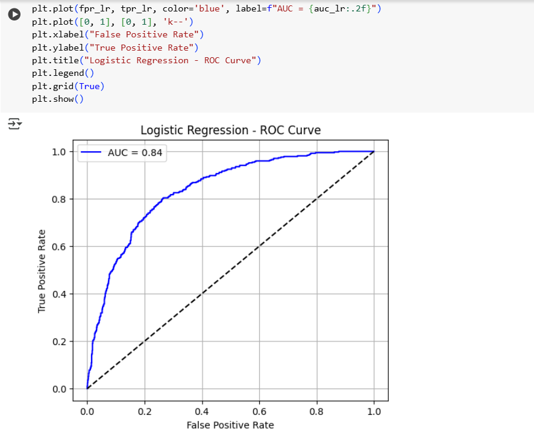
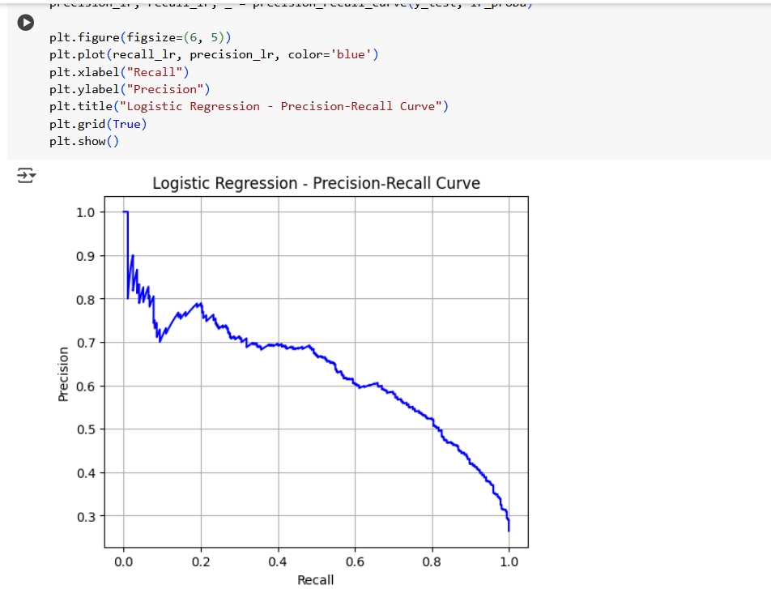
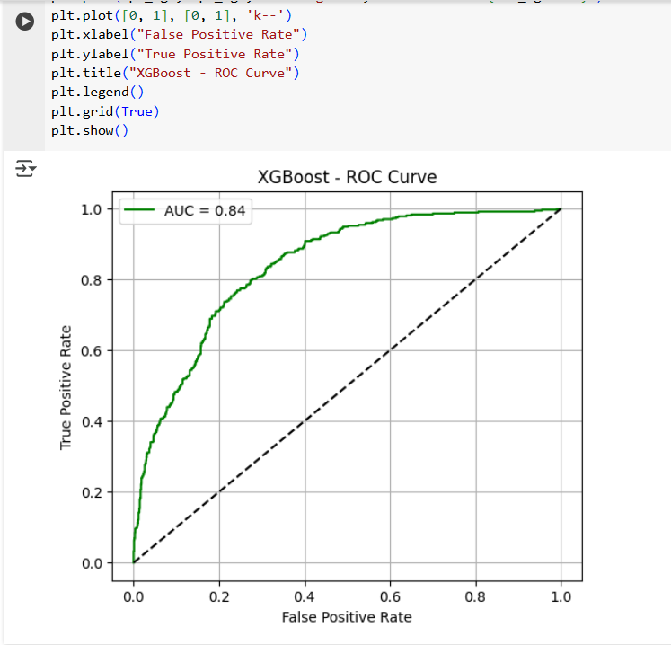
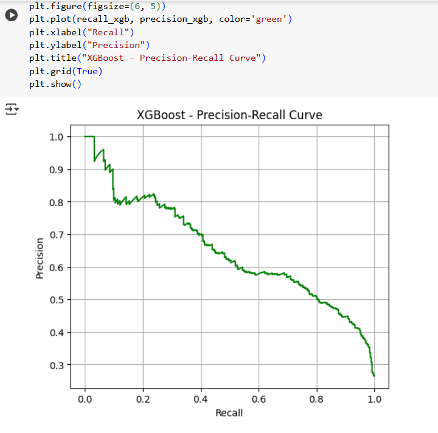

# Customer Churn Prediction
This project predicts customer churn using machine learning models such as Logistic Regression and XGBoost. It also includes model interpretability using **SHAP** and **LIME** to explain predictions.
## File
-customer_churn_prediction.py`: Python script with full pipeline — data loading, preprocessing, model training, evaluation, and explainability.
## Features
- Load and clean telecom customer churn dataset
- Handle missing values and convert data types
- One-hot encode categorical features
- Train-test split and scaling
- Train models:
  - Logistic Regression
  - XGBoost Classifier
- Evaluate using:
  - Confusion Matrix
  - Classification Report
  - ROC Curve
  - Precision-Recall Curve
- Explain model predictions using:
  - SHAP
  - LIME
## Visualizations

### ROC Curve - Logistic Regression

### Precision-Recall Curve - Logistic Regression

### ROC Curve - XGBoost

### Precision-Recall Curve - XGBoost

## Tools Used
- Python
- Pandas, NumPy
- Scikit-learn
- XGBoost
- Matplotlib, Seaborn
- SHAP
- LIME

